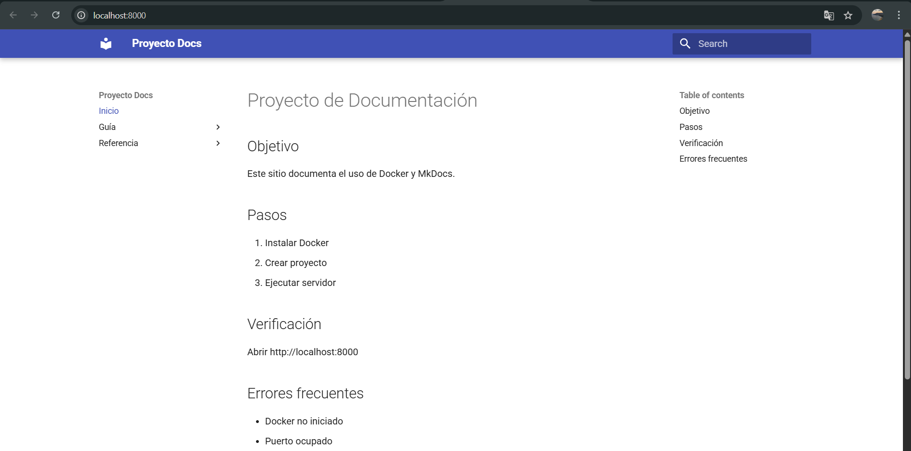

# Proyecto de Documentación

## Objetivo
Este sitio web tiene como objetivo explicar cómo crear documentación técnica utilizando MkDocs y Docker.

## Requisitos
- Tener Docker instalado
- Tener Git instalado
- Tener una cuenta en GitHub

## Pasos
1. Instalar Docker
2. Crear el proyecto MkDocs
3. Ejecutar el servidor
4. Visualizar la documentación en el navegador

## Verificación
Abrir http://localhost:8000 y comprobar que la página se visualiza correctamente con el menú lateral.

## Errores frecuentes
- Docker no iniciado
- Puerto 8000 ocupado
- Archivos mal ubicados

## Enlaces
[Ir a Quickstart](guia/quickstart.md)  
[Guía de instalación](guia/instalacion.md)  
[Documentación oficial de MkDocs](https://www.mkdocs.org/)

## Imagen
